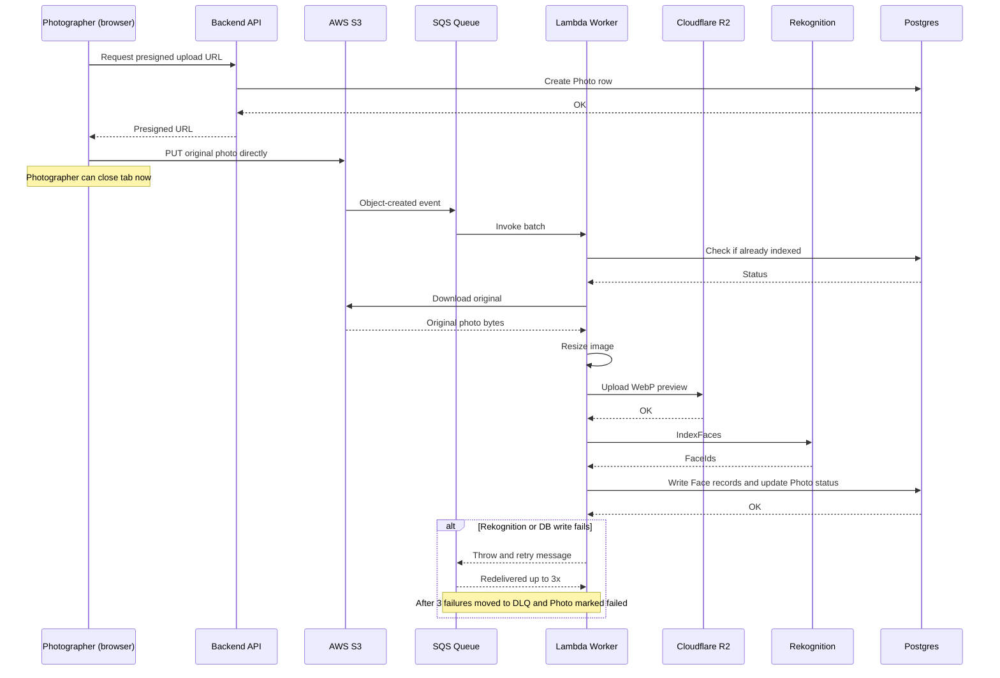
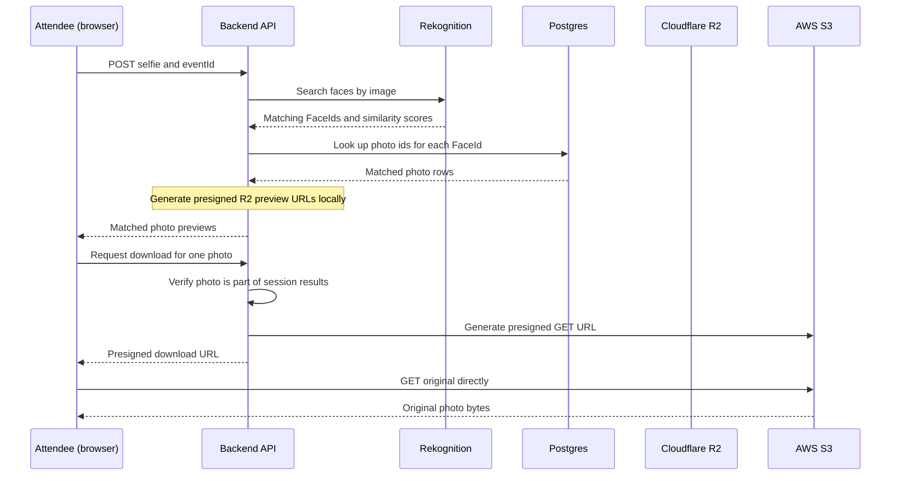

# Facet 

Facet is an event photography platform connecting photographers with
attendees through automated face-recognition indexing. Photographers
batch-upload event photos; attendees find their own photos by
uploading a selfie, no account or manual tagging required.

Built as a full production-shaped system — not a demo — with an
async processing pipeline, presigned-URL upload/download flows, and
deliberate tradeoffs made and documented along the way (see
[Design Decisions](#-design-decisions--tradeoffs) below).

## 🌟 Key Features

- **Selfie-based photo search** — attendees upload a selfie; the
  backend queries AWS Rekognition against that event's face
  collection and returns matching photos. No account required.
- **Asynchronous batch indexing** — photographers upload directly to
  S3 via presigned URLs. Indexing (resize, face detection, database
  writes) happens independently via SQS + Lambda, and survives the
  photographer closing their browser mid-upload.
- **Dual-storage split** — full-resolution originals live in S3
  (native Rekognition integration); compressed WebP previews are
  served from Cloudflare R2 (zero egress fees on the highest-traffic
  path — attendees browsing galleries).
- **Idempotent, retry-safe indexing** — Lambda checks photo status
  before processing, so SQS's at-least-once delivery can never
  double-index a photo or create duplicate face records.
- **Passwordless + social auth** for photographers via Better-Auth
  (email/password + Google OAuth). Attendees remain guest/session-based
  by design — see [Design Decisions](#-design-decisions--tradeoffs).

## 🏗️ Architecture

<style>
  .mermaid text, 
  .nodeLabel, 
  .edgeLabel, 
  .messageText, 
  .actor {
    font-size: 18px !important;
  }
</style>


### Upload → Index sequence (asynchronous, survives disconnect)

This is the flow most worth understanding: the photographer's browser
is only involved in the upload step. Everything after that runs
independently, server-side.



### Selfie search → download sequence




## 📁 Repository Structure

<details open>
<summary><b>Frontend (Next.js)</b></summary>

```text
frontend/
├── src/
│   ├── app/                  # App router pages
│   │   ├── (auth)/           # Authentication routes
│   │   ├── (attendee)/       # Attendee public event search UI
│   │   └── (photographer)/   # Photographer dashboard & uploads
│   ├── components/           # Shadcn UI library & domain components
│   ├── hooks/                # React Query custom hooks for data fetching
│   ├── lib/                  # Shared utilities & constants
│   ├── providers/            # React context providers (Auth, Query)
│   └── types/                # TypeScript interface definitions
├── package.json
└── tailwind.config.ts
```
</details>

<details open>
<summary><b>Backend (Express.js)</b></summary>

```text
backend/
├── src/
│   ├── app/
│   │   ├── modules/          # Domain-driven feature modules
│   │   │   ├── auth/         # JWT generation & validation
│   │   │   ├── events/       # Event creation & management
│   │   │   ├── photos/       # Presigned URL generation
│   │   │   ├── search/       # Face matching & download URLs
│   │   │   └── webhooks/     # Stripe integration etc.
│   │   └── common/           # Shared utilities, storage clients
│   └── server.ts             # Express server entry point
├── prisma/                   # Database schema & migrations
└── package.json
```
</details>

<details open>
<summary><b>Lambda (Serverless Worker)</b></summary>

```text
lambda/
├── src/
│   ├── handlers/             # SQS Event consumers (indexPhoto.js)
│   ├── services/
│   │   ├── dbService.js          # Postgres/Prisma interactions
│   │   ├── imageService.js       # Sharp resizing
│   │   ├── r2Service.js          # Cloudflare WebP uploads
│   │   ├── rekognitionService.js # AWS IndexFaces
│   │   └── s3Service.js          # Downloading original uploads
│   └── utils/                # Helper functions
├── config.js                 # Environment configuration
├── prisma.config.ts          # Prisma CLI config
└── deploy.ps1                # Packaging/deployment script (Windows)
```
</details>

## 🚀 Tech Stack

| Layer | Choice |
|---|---|
| Frontend | Next.js, React, Tailwind CSS, Shadcn UI, React Query, Zustand |
| Backend | Express.js, TypeScript, Better-Auth, Zod, Prisma ORM |
| Worker | AWS Lambda, Sharp |
| Infra | AWS S3, AWS SQS, AWS Rekognition, Cloudflare R2 |
| Database | Neon (PostgreSQL), Prisma ORM |

## 🛠️ Local Setup

1. **Clone the repository**
   ```bash
   git clone <repo-url>
   cd Facet
   ```

2. **Configure environment variables**
   - Copy `.env.example` → `.env` in both `backend/` and `lambda/`.
   - Fill in AWS, Cloudflare, and Neon credentials.
   - Point `frontend/.env.local` at your local backend API.

3. **Install dependencies** (three independent projects — no shared
   workspace tooling, install each separately)
   ```bash
   cd backend && npm install
   cd ../frontend && npm install
   cd ../lambda && npm install
   ```

4. **Run backend + frontend**
   ```bash
   # Terminal 1
   cd backend && npm run dev

   # Terminal 2
   cd frontend && npm run dev
   ```

5. **Deploy the Lambda** (Windows/PowerShell)
   ```powershell
   cd lambda
   npm run build   # prisma generate + force Linux Sharp binary + prune devDependencies
   .\deploy.ps1    # packages lambda.zip
   ```
   Upload `lambda.zip` via the AWS Lambda console. See `lambda/INFRASTRUCTURE.md`
   for IAM policies, SQS/DLQ settings, and the full manual deployment checklist.